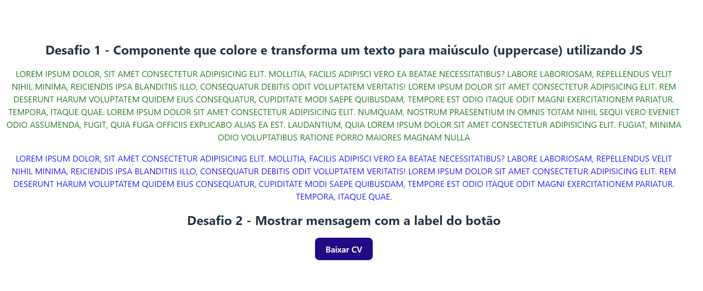
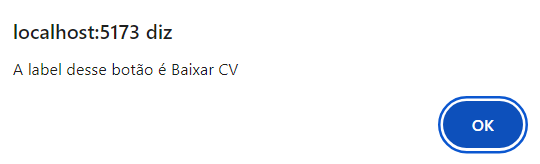

# Quest React Básico

Este é o projeto da quest de react básico.

[] 

## O Projeto

São dois desafios, o primeiro é utilizar um componente react para renderizar na tela um parágrafo colorido, utilizando props, e com as letras maiúsculas utilizando o método Uppercase do JavaScript.
O segundo desafio é criar um componente de botão com um evento de clique que apresenta uma mensagem de alerta quando clicado, informando a prop do botão. 

[] 

### Linguagens utilizadas 

- CSS

- JavaScript

- React